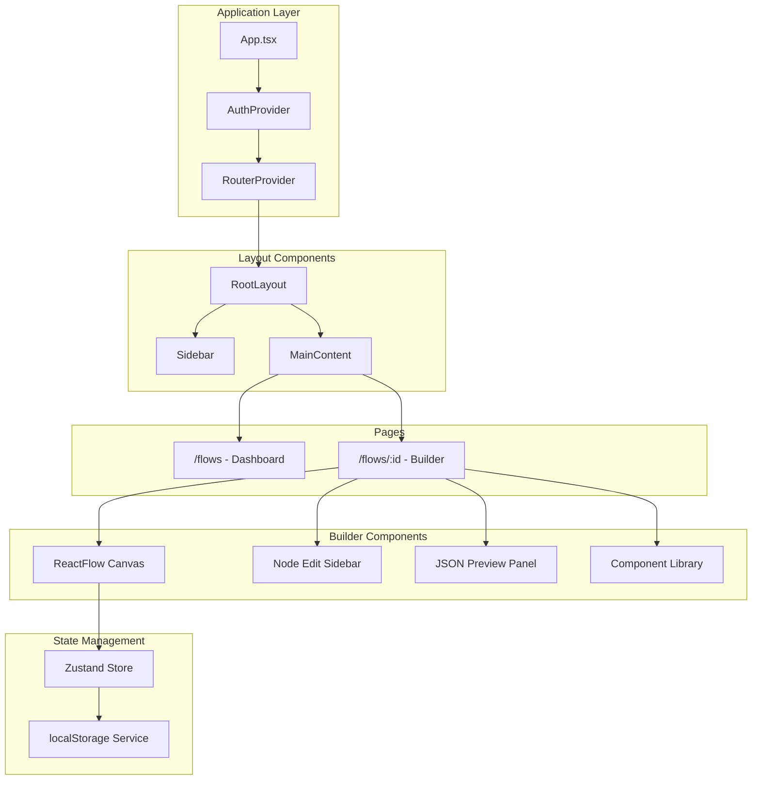

# Workflow Builder - Detailed Implementation Plan

## Architecture Overview




## Data Model

```typescript
// src/types/workflow.ts

type NodeId = string;
type EdgeId = string;
type WorkflowId = string;

interface Position {
  x: number;
  y: number;
}

interface WorkflowNode {
  id: NodeId;
  type: 'start' | 'default';
  label: string;
  description: string;
  position: Position;
}

interface WorkflowEdge {
  id: EdgeId;
  source: NodeId;
  target: NodeId;
  condition: string;
}

interface Workflow {
  id: WorkflowId;
  name: string;
  nodes: WorkflowNode[];
  edges: WorkflowEdge[];
  createdAt: string;
  updatedAt: string;
  createdBy: string;
}

interface ValidationError {
  field: string;
  nodeId?: NodeId;
  edgeId?: EdgeId;
  message: string;
}
```

## Folder Structure

```
src/
├── components/
│   ├── layout/
│   │   ├── RootLayout.tsx
│   │   ├── Sidebar.tsx
│   │   └── MainContent.tsx
│   ├── flows/
│   │   ├── WorkflowCard.tsx
│   │   ├── WorkflowGrid.tsx
│   │   └── EmptyState.tsx
│   ├── builder/
│   │   ├── BuilderCanvas.tsx
│   │   ├── NodeSidebar.tsx
│   │   ├── JSONPreviewPanel.tsx
│   │   ├── NodeLibrary.tsx
│   │   ├── nodes/
│   │   │   ├── StartNode.tsx
│   │   │   └── DefaultNode.tsx
│   │   └── edges/
│   │       └── ConditionalEdge.tsx
│   └── ui/
│       ├── Button.tsx
│       ├── Input.tsx
│       ├── InlineEdit.tsx
│       └── ErrorMessage.tsx
├── hooks/
│   ├── useAuth.ts
│   ├── useWorkflow.ts
│   └── useValidation.ts
├── lib/
│   ├── storage.ts
│   ├── validation.ts
│   └── utils.ts
├── pages/
│   ├── FlowsPage.tsx
│   └── BuilderPage.tsx
├── store/
│   └── workflowStore.ts
├── types/
│   └── workflow.ts
├── App.tsx
├── main.tsx
└── index.css
```

---

## Phase 1: Project Scaffolding

**Goal:** Initialize the project with Vite, React, TypeScript, and Tailwind CSS v4 with a Claude-inspired color palette.

**Files to create/modify:**

- `package.json` - dependencies (renamed to "workflow-builder")
- `vite.config.ts` - Vite configuration
- `postcss.config.js` - PostCSS with `@tailwindcss/postcss`
- `src/index.css` - Tailwind v4 import + `@theme` for custom colors
- `src/main.tsx` - Entry point
- `src/App.tsx` - Minimal shell
- `index.html` - Updated title to "Workflow Builder"

**Tailwind v4 CSS-based configuration:**

```css
/* src/index.css */
@import "tailwindcss";
@import url('https://fonts.googleapis.com/css2?family=Work+Sans:wght@400;500;600;700&display=swap');

@theme {
  --color-cream-50: #FDFBF7;
  --color-cream-100: #FAF6EE;
  --color-cream-200: #F5EDE0;
  --color-cream-300: #E8DCC8;

  --color-clay-400: #C4A77D;
  --color-clay-500: #B8956C;
  --color-clay-600: #A67C52;

  --color-terracotta-500: #D4785C;
  --color-terracotta-600: #C4603D;
  --color-terracotta-700: #A84E32;

  --color-charcoal-700: #4A4540;
  --color-charcoal-800: #353330;
  --color-charcoal-900: #1F1E1C;

  --font-family-sans: 'Work Sans', system-ui, sans-serif;
}
```

**Commands:**

```bash
npm install -D tailwindcss postcss autoprefixer @tailwindcss/postcss
```

---

## Phase 2: Routing and Layout Shell

**Goal:** Set up React Router with root layout containing sidebar placeholder and content area.

**Dependencies:** `react-router-dom`

**Files:**

- `src/App.tsx` - Router setup using `createBrowserRouter`
- `src/components/layout/RootLayout.tsx` - Sidebar placeholder + MainContent
- `src/components/layout/MainContent.tsx` - Wraps `<Outlet />` in `<main>`
- `src/pages/FlowsPage.tsx` - Placeholder
- `src/pages/BuilderPage.tsx` - Placeholder with `useParams` for workflow ID

**Router structure (modern data router API):**

```typescript
// src/App.tsx
import { createBrowserRouter, Navigate, RouterProvider } from 'react-router-dom';

const router = createBrowserRouter([
  {
    path: '/',
    element: <RootLayout />,
    children: [
      {
        index: true,
        element: <Navigate to="/flows" replace />,
      },
      {
        path: 'flows',
        element: <FlowsPage />,
      },
      {
        path: 'flows/:id',
        element: <BuilderPage />,
      },
    ],
  },
]);

function App() {
  return <RouterProvider router={router} />;
}
```

**Routing decisions:**

- `/` → `/flows`: Uses `replace` (not `push`) because `/` isn't a real page, prevents back-button loop
- All other navigation: Uses `push` (default behavior of `<Link>` and `navigate()`)

**Layout structure:**

```
┌──────────────────────────────────────────┐
│ RootLayout                               │
│ ┌────────┬──────────────────────────────┐│
│ │Sidebar │  MainContent (Outlet)        ││
│ │        │                              ││
│ │        │                              ││
│ └────────┴──────────────────────────────┘│
└──────────────────────────────────────────┘
```

---

## Phase 3: Auth Hook and App Initialization

**Goal:** Create dummy auth hook with loading/error states, wrap app in auth context.

**Files:**

- `src/hooks/useAuth.ts` - Dummy auth hook
- `src/context/AuthContext.tsx` - Auth provider
- `src/App.tsx` - Wrap with AuthProvider, show loading

**Types:**

```typescript
interface IUser {
  id: string;
  name: string;
  email: string;
}

interface IAuthState {
  user: IUser | null;
  isLoading: boolean;
  isError: boolean;
}
```

**Naming conventions:**

- Interfaces: `I` prefix (e.g., `IUser`, `IAuthState`)
- Component props: `ComponentNameProps` (e.g., `AuthProviderProps`)

**useAuth behavior:**

```typescript
// Returns after 800ms simulated delay
// Always returns success for now (isError: false)
{
  user: {
    id: 'usr_1234567890',
    name: 'Rohan',
    email: 'rohan@example.com',
  },
  isLoading: false,
  isError: false,
}
```

**Loading screen:** Simple centered spinner with "Initializing..." text on cream background.

---

## Phase 4: Sidebar Component

**Goal:** Build the sidebar with Workflows nav item and active state styling.

**Files:**

- `src/components/layout/Sidebar.tsx` - Full implementation

**Features:**

- App logo/title at top
- "Workflows" nav item with graph icon
- Active state: terracotta background, cream text
- Inactive state: charcoal text, hover effect
- Fixed width (240px)

---

## Phase 5: Flows List Page - Static UI

**Goal:** Build the dashboard page with static UI (no data wiring yet).

**Files:**

- `src/pages/FlowsPage.tsx` - Page layout
- `src/components/flows/FlowsHeader.tsx` - Centered header with title, subtitle, create button
- `src/components/flows/FlowsToolbar.tsx` - Search bar + sort dropdown
- `src/components/flows/WorkflowCard.tsx` - Card component
- `src/components/flows/WorkflowGrid.tsx` - Grid container
- `src/components/flows/EmptyState.tsx` - No workflows state
- `src/components/ui/Button.tsx` - Reusable button

**Page layout:**

```
┌─────────────────────────────────────────────────────────┐
│                                                         │
│                   Create a workflow                     │  <- centered title
│         Build a custom workflow with ease               │  <- centered subtitle
│                                                         │
│                      [+ Create]                         │  <- centered button
│                                                         │
│  [🔍 Search workflows...        ]  [Sort by ▼]          │  <- search + sort
│                                                         │
│  ┌──────────┐ ┌──────────┐ ┌──────────┐ ┌──────────┐   │
│  │  [icon]  │ │  [icon]  │ │  [icon]  │ │  [icon]  │   │  <- responsive grid
│  │  Name    │ │  Name    │ │  Name    │ │  Name    │   │
│  │  Desc... │ │  Desc... │ │  Desc... │ │  Desc... │   │
│  │          │ │          │ │          │ │          │   │
│  │ created  │ │ created  │ │ created  │ │ created  │   │
│  │ updated  │ │ updated  │ │ updated  │ │ updated  │   │
│  │     user │ │     user │ │     user │ │     user │   │
│  └──────────┘ └──────────┘ └──────────┘ └──────────┘   │
│                                                         │
└─────────────────────────────────────────────────────────┘
```

**FlowsHeader:**

- Centered layout
- Title: "Create a workflow" (large, bold)
- Subtitle: "Build a custom workflow with ease" (smaller, muted)
- "+ Create" button below (outlined style)

**FlowsToolbar:**

- Left side: Search input (filters by workflow name)
- Right side: Sort dropdown with options:
  - "Last edited" (default) - sorts by updatedAt descending
  - "Date created" - sorts by createdAt descending
- Timestamps include timezone handling

**WorkflowCard content:**

- Icon in top-left (workflow/graph icon in colored circle)
- Workflow name below icon (bold, truncated if long)
- Description below name (smaller text, 1-2 lines, truncated) - mandatory field
- Created date (small, muted) - e.g., "Created: 4 Mar, 16:46"
- Last updated date (small, muted) - e.g., "Updated: 4 Mar, 18:23"
- Creator name (bottom-right, small text)
- Hover: subtle shadow/border lift
- Delete button appears on hover (top-right corner)

---

## Phase 6: Workflow Service and CRUD

**Goal:** Implement a service abstraction for workflow persistence with localStorage implementation, wire up create/delete.

**Architecture:**

The service layer uses dependency inversion - we define an interface (contract) and provide a localStorage implementation. This allows swapping to an API-based implementation later without changing consuming code.

```
┌─────────────────────────────────────────┐
│  Components / Hooks                     │
│  (import workflowService directly)      │
└─────────────────┬───────────────────────┘
                  │
                  ▼
┌─────────────────────────────────────────┐
│  IWorkflowService (interface/type)      │
│  - All methods return Promises          │
│  - Defines the contract                 │
└─────────────────┬───────────────────────┘
                  │
                  ▼
┌─────────────────────────────────────────┐
│  localStorageWorkflowService            │
│  (current implementation)               │
│  - Implements the interface             │
│  - Uses localStorage under the hood     │
│  - Returns Promises (for API compat)    │
└─────────────────────────────────────────┘
```

**Files:**

- `src/types/workflow.ts` - Update with service types
- `src/services/workflowService.ts` - Interface + localStorage implementation
- `src/hooks/useWorkflows.ts` - Hook for fetching/listing workflows
- `src/hooks/useCreateWorkflow.ts` - Hook for creating a workflow
- `src/hooks/useUpdateWorkflow.ts` - Hook for updating a workflow
- `src/hooks/useDeleteWorkflow.ts` - Hook for deleting a workflow
- `src/pages/FlowsPage.tsx` - Wire up CRUD using the hooks
- `src/components/flows/DeleteWorkflowDialog.tsx` - Confirmation modal for delete
- `src/App.tsx` - Add Toaster provider

**Dependencies to add:**

```bash
npx shadcn@latest add sonner alert-dialog
```

**Service interface (type, not class):**

```typescript
// src/types/workflow.ts

// Input type for updating a workflow
type UpdateWorkflowInput = Partial<Pick<IWorkflow, 'name' | 'description'>>;

// Service interface - all methods return Promises
type IWorkflowService = {
  getAll: () => Promise<IWorkflow[]>;
  getById: (id: string) => Promise<IWorkflow | null>;
  create: () => Promise<IWorkflow>;  // Creates with defaults
  update: (id: string, input: UpdateWorkflowInput) => Promise<IWorkflow>;
  delete: (id: string) => Promise<void>;
};
```

**localStorage implementation (functional, not class):**

```typescript
// src/services/workflowService.ts
import { v4 as uuidv4 } from 'uuid';

const STORAGE_KEY = 'flowbuilder_workflows';

// Helper to get current user (from auth context or mock)
const getCurrentUser = () => 'Rohan'; // TODO: wire to auth

export const workflowService: IWorkflowService = {
  getAll: async () => {
    const data = localStorage.getItem(STORAGE_KEY);
    if (!data) return [];
    const workflows = JSON.parse(data) as IWorkflow[];
    // Parse date strings back to Date objects
    return workflows.map(w => ({
      ...w,
      createdAt: new Date(w.createdAt),
      updatedAt: new Date(w.updatedAt),
    }));
  },

  getById: async (id) => {
    const workflows = await workflowService.getAll();
    return workflows.find(w => w.id === id) ?? null;
  },

  create: async () => {
    const workflows = await workflowService.getAll();
    const now = new Date();
    const newWorkflow: IWorkflow = {
      id: uuidv4(),
      name: 'Untitled Workflow',
      description: '',
      createdAt: now,
      updatedAt: now,
      createdBy: getCurrentUser(),
    };
    workflows.push(newWorkflow);
    localStorage.setItem(STORAGE_KEY, JSON.stringify(workflows));
    return newWorkflow;
  },

  update: async (id, input) => {
    const workflows = await workflowService.getAll();
    const index = workflows.findIndex(w => w.id === id);
    if (index === -1) throw new Error(`Workflow ${id} not found`);

    const updated: IWorkflow = {
      ...workflows[index],
      ...input,
      updatedAt: new Date(),
    };
    workflows[index] = updated;
    localStorage.setItem(STORAGE_KEY, JSON.stringify(workflows));
    return updated;
  },

  delete: async (id) => {
    const workflows = await workflowService.getAll();
    const filtered = workflows.filter(w => w.id !== id);
    localStorage.setItem(STORAGE_KEY, JSON.stringify(filtered));
  },
};
```

**Hooks (separate concerns):**

Each hook is explicit about what it does. Mutation hooks accept an `onSuccess` callback for coordinating list updates.

```typescript
// src/hooks/useWorkflows.ts - Fetching/listing only
import { useState, useEffect, useCallback } from 'react';
import { workflowService } from '@/services/workflowService';
import { IWorkflow } from '@/types/workflow';

export function useWorkflows() {
  const [workflows, setWorkflows] = useState<IWorkflow[]>([]);
  const [isLoading, setIsLoading] = useState(true);
  const [error, setError] = useState<Error | null>(null);

  const fetchWorkflows = useCallback(async () => {
    try {
      setError(null);
      setIsLoading(true);
      const data = await workflowService.getAll();
      setWorkflows(data);
    } catch (err) {
      setError(err instanceof Error ? err : new Error('Failed to fetch workflows'));
    } finally {
      setIsLoading(false);
    }
  }, []);

  useEffect(() => {
    fetchWorkflows();
  }, [fetchWorkflows]);

  return {
    workflows,
    isLoading,
    error,
    refetch: fetchWorkflows,
  };
}
```

```typescript
// src/hooks/useCreateWorkflow.ts
import { useState, useCallback } from 'react';
import { workflowService } from '@/services/workflowService';
import { IWorkflow } from '@/types/workflow';
import { toast } from 'sonner';

interface UseCreateWorkflowOptions {
  onSuccess?: (workflow: IWorkflow) => void;
}

export function useCreateWorkflow(options?: UseCreateWorkflowOptions) {
  const [isCreating, setIsCreating] = useState(false);
  const [error, setError] = useState<Error | null>(null);

  const createWorkflow = useCallback(async () => {
    try {
      setError(null);
      setIsCreating(true);
      const newWorkflow = await workflowService.create();
      toast.success('Workflow created');
      options?.onSuccess?.(newWorkflow);
      return newWorkflow;
    } catch (err) {
      const error = err instanceof Error ? err : new Error('Failed to create workflow');
      setError(error);
      toast.error(error.message);
      throw error;
    } finally {
      setIsCreating(false);
    }
  }, [options]);

  return { createWorkflow, isCreating, error };
}
```

```typescript
// src/hooks/useUpdateWorkflow.ts
import { useState, useCallback } from 'react';
import { workflowService } from '@/services/workflowService';
import { IWorkflow, UpdateWorkflowInput } from '@/types/workflow';
import { toast } from 'sonner';

interface UseUpdateWorkflowOptions {
  onSuccess?: (workflow: IWorkflow) => void;
}

export function useUpdateWorkflow(options?: UseUpdateWorkflowOptions) {
  const [isUpdating, setIsUpdating] = useState(false);
  const [error, setError] = useState<Error | null>(null);

  const updateWorkflow = useCallback(async (id: string, input: UpdateWorkflowInput) => {
    try {
      setError(null);
      setIsUpdating(true);
      const updated = await workflowService.update(id, input);
      toast.success('Workflow updated');
      options?.onSuccess?.(updated);
      return updated;
    } catch (err) {
      const error = err instanceof Error ? err : new Error('Failed to update workflow');
      setError(error);
      toast.error(error.message);
      throw error;
    } finally {
      setIsUpdating(false);
    }
  }, [options]);

  return { updateWorkflow, isUpdating, error };
}
```

```typescript
// src/hooks/useDeleteWorkflow.ts
import { useState, useCallback } from 'react';
import { workflowService } from '@/services/workflowService';
import { toast } from 'sonner';

interface UseDeleteWorkflowOptions {
  onSuccess?: (id: string) => void;
}

export function useDeleteWorkflow(options?: UseDeleteWorkflowOptions) {
  const [isDeleting, setIsDeleting] = useState(false);
  const [error, setError] = useState<Error | null>(null);

  const deleteWorkflow = useCallback(async (id: string) => {
    try {
      setError(null);
      setIsDeleting(true);
      await workflowService.delete(id);
      toast.success('Workflow deleted');
      options?.onSuccess?.(id);
    } catch (err) {
      const error = err instanceof Error ? err : new Error('Failed to delete workflow');
      setError(error);
      toast.error(error.message);
      throw error;
    } finally {
      setIsDeleting(false);
    }
  }, [options]);

  return { deleteWorkflow, isDeleting, error };
}
```

**Usage in FlowsPage:**

```typescript
// src/pages/FlowsPage.tsx
export function FlowsPage() {
  const { workflows, isLoading, refetch } = useWorkflows();
  const { createWorkflow, isCreating } = useCreateWorkflow({ onSuccess: refetch });
  const { deleteWorkflow, isDeleting } = useDeleteWorkflow({ onSuccess: refetch });

  // ...
}
```

**Create flow:**

1. User clicks "+ Create" button
2. Call `createWorkflow()` - service uses defaults ('Untitled Workflow', '')
3. Service generates UUID, timestamps, adds createdBy
4. Save to localStorage
5. Navigate to `/flows/[id]` with returned workflow ID

**Delete flow:**

1. User hovers card, clicks delete button
2. Show confirmation dialog (AlertDialog from shadcn)
3. User confirms → call `deleteWorkflow(id)`
4. Service removes from localStorage
5. UI updates via state
6. Toast shows "Workflow deleted"

**Delete confirmation dialog:**

```typescript
// src/components/flows/DeleteWorkflowDialog.tsx
import {
  AlertDialog,
  AlertDialogAction,
  AlertDialogCancel,
  AlertDialogContent,
  AlertDialogDescription,
  AlertDialogFooter,
  AlertDialogHeader,
  AlertDialogTitle,
} from '@/components/ui/alert-dialog';

interface DeleteWorkflowDialogProps {
  open: boolean;
  onOpenChange: (open: boolean) => void;
  workflowName: string;
  onConfirm: () => void;
}

export function DeleteWorkflowDialog({
  open,
  onOpenChange,
  workflowName,
  onConfirm,
}: DeleteWorkflowDialogProps) {
  return (
    <AlertDialog open={open} onOpenChange={onOpenChange}>
      <AlertDialogContent>
        <AlertDialogHeader>
          <AlertDialogTitle>Delete workflow?</AlertDialogTitle>
          <AlertDialogDescription>
            Are you sure you want to delete "{workflowName}"? This action cannot be undone.
          </AlertDialogDescription>
        </AlertDialogHeader>
        <AlertDialogFooter>
          <AlertDialogCancel>Cancel</AlertDialogCancel>
          <AlertDialogAction onClick={onConfirm}>Delete</AlertDialogAction>
        </AlertDialogFooter>
      </AlertDialogContent>
    </AlertDialog>
  );
}
```

**Toast setup:**

```typescript
// src/App.tsx - Add Toaster to the app
import { Toaster } from '@/components/ui/sonner';

function App() {
  return (
    <>
      <AuthProvider>
        <RouterProvider router={router} />
      </AuthProvider>
      <Toaster position="bottom-right" />
    </>
  );
}
```

**Why Promises for localStorage?**

Even though localStorage is synchronous, we return Promises because:

- Maintains consistent async interface
- Allows easy swap to API implementation later
- Components already handle loading/error states
- No refactoring needed when backend is added

---

## Phase 7: Flow Builder Page - Shell

**Goal:** Build the builder page layout with header, canvas placeholder, and collapsible JSON panel.

**Files:**

- `src/pages/BuilderPage.tsx` - Page layout
- `src/components/builder/BuilderHeader.tsx` - Header with editable name
- `src/components/builder/JSONPreviewPanel.tsx` - Collapsible panel (empty)
- `src/components/ui/InlineEdit.tsx` - Double-click editable text

**Layout:**

```
┌─────────────────────────────────────────────────────────┐
│ [Back] │ Workflow Name (dbl-click to edit) │            │
├─────────────────────────────────────────────────────────┤
│                                                         │
│                   Canvas Area                           │
│                   (placeholder)                         │
│                                                         │
├─────────────────────────────────────────────────────────┤
│ ▼ JSON Preview  [collapsed by default]                  │
└─────────────────────────────────────────────────────────┘
```

**Features:**

- Back button → navigate to `/flows`
- Workflow name: double-click → inline input → blur/Enter saves
- Document title syncs with workflow name
- JSON panel: collapsed by default, click header to expand
- Auto-save workflow changes to localStorage

---

## Phase 8: React Flow - Basic Canvas

**Goal:** Integrate React Flow with basic node operations.

**Dependencies:** `reactflow`

**Files:**

- `src/components/builder/BuilderCanvas.tsx` - React Flow wrapper
- `src/store/workflowStore.ts` - Zustand store for flow state
- `src/pages/BuilderPage.tsx` - Integrate canvas

**Zustand store:**

```typescript
interface WorkflowState {
  nodes: Node[];
  edges: Edge[];
  selectedNodeId: string | null;

  // Actions
  addNode: (type: string, position: Position) => void;
  updateNode: (id: string, data: Partial<WorkflowNode>) => void;
  deleteNode: (id: string) => void;
  setSelectedNode: (id: string | null) => void;

  onNodesChange: OnNodesChange;
  onEdgesChange: OnEdgesChange;
  onConnect: OnConnect;
}
```

**Canvas features:**

- Pan and zoom
- Node selection
- Node dragging
- Background grid/dots

---

## Phase 9: Start Node and Node Library

**Goal:** Create node types and a component library panel to add nodes.

**Files:**

- `src/components/builder/nodes/StartNode.tsx` - Start node component
- `src/components/builder/nodes/DefaultNode.tsx` - Regular node component
- `src/components/builder/NodeLibrary.tsx` - Draggable node palette

**Node types:**

- **Start Node:** Green accent, "Start" label, single output handle
- **Default Node:** Cream background, editable label, input + output handles

**Node Library panel:**

- Fixed position (top-left of canvas or floating panel)
- Draggable items: "Start" and "Step"
- Drag onto canvas to create node

---

## Phase 10: Edges and Connections

**Goal:** Enable edge creation with condition labels.

**Files:**

- `src/components/builder/edges/ConditionalEdge.tsx` - Custom edge with label
- `src/store/workflowStore.ts` - Edge handling
- `src/components/builder/BuilderCanvas.tsx` - Edge types registration

**Edge features:**

- Arrow marker at target
- Condition label displayed on edge (default: "condition")
- Smooth bezier curve
- Selectable (for deletion)

---

## Phase 11: Node Sidebar - Editing

**Goal:** Build the right sidebar for editing selected node.

**Files:**

- `src/components/builder/NodeSidebar.tsx` - Sidebar component
- `src/components/builder/EdgeList.tsx` - Manage outgoing edges
- `src/pages/BuilderPage.tsx` - Integrate sidebar

**Sidebar layout:**

```
┌─────────────────────────┐
│ Node Settings      [X]  │
├─────────────────────────┤
│ ID                      │
│ [____________]          │
│                         │
│ Description             │
│ [____________]          │
│ [____________]          │
│                         │
│ Outgoing Edges          │
│ ┌─────────────────────┐ │
│ │ → NodeB | "cond"    │ │
│ │              [del]  │ │
│ └─────────────────────┘ │
│ [+ Add Edge]            │
└─────────────────────────┘
```

**Features:**

- Appears when node is selected
- Close button (or click away to deselect)
- ID field: text input, validates uniqueness on blur
- Description: textarea
- Edge list: shows target node + condition, delete button
- Add edge: dropdown to pick target, input for condition

---

## Phase 12: JSON Preview Panel

**Goal:** Implement live JSON preview with syntax highlighting.

**Dependencies:** `prism-react-renderer` (or similar)

**Files:**

- `src/components/builder/JSONPreviewPanel.tsx` - Full implementation
- `src/lib/exportWorkflow.ts` - Convert store state to export format

**Export format:**

```typescript
interface ExportedWorkflow {
  id: string;
  name: string;
  startNodeId: string | null;
  nodes: Array<{
    id: string;
    type: string;
    label: string;
    description: string;
  }>;
  edges: Array<{
    id: string;
    source: string;
    target: string;
    condition: string;
  }>;
}
```

**Features:**

- Collapsible panel at bottom
- Expand/collapse toggle
- Syntax highlighted JSON
- Updates live as user edits

---

## Phase 13: Validation and Error Display

**Goal:** Implement validation rules with inline error display.

**Files:**

- `src/lib/validation.ts` - Validation functions
- `src/hooks/useValidation.ts` - Hook to run validation
- `src/components/builder/NodeSidebar.tsx` - Show errors
- `src/components/builder/BuilderCanvas.tsx` - Visual indicators

**Validation rules:**

- Node IDs must be unique
- Description is required for each node
- Start node must exist
- Edge targets must reference valid nodes
- Edge conditions must not be empty

**Error display:**

- Red border on invalid input fields
- Error message below field
- Red outline on invalid nodes in canvas
- Validation runs on every change (debounced)

---

## Phase 14: Polish and Bonus Features

**Goal:** Implement nice-to-have features.

**Features:**

- **Copy JSON:** Button in JSON panel → copy to clipboard
- **Download JSON:** Button → download as `.json` file
- **Import JSON:** Button in header → file picker or paste modal → validate with Zod → reconstruct flow
- **Delete key:** Keyboard handler → delete selected node/edge
- **Disconnected warning:** Highlight nodes not reachable from start node (yellow indicator)

**Files:**

- `src/components/builder/ImportModal.tsx` - Import JSON modal
- `src/lib/importWorkflow.ts` - Parse and validate imported JSON
- `src/hooks/useKeyboardShortcuts.ts` - Delete key handler
- `src/lib/graphAnalysis.ts` - Reachability check

---

## Testing Checklist (Reviewer Script)

Before submission, verify:

- Create 5+ nodes quickly
- Drag nodes around
- Connect edges in multiple directions
- Rename a node ID → edges still valid
- Delete node with edges → edges removed
- Leave description empty → error shown
- Remove start node → validation error
- Import invalid JSON → error message
- Export JSON → valid structure
- Refresh page → data persists

